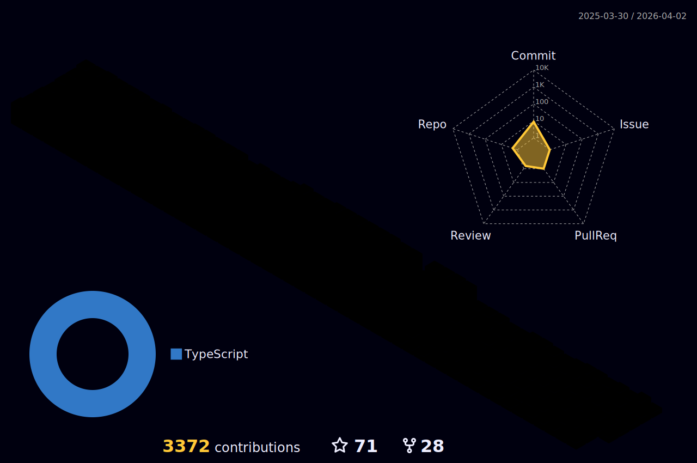

<h2 align="center">Hi,I'm Kush!</h2>
<h3 align="center">I'm a passionate Full Stack Developer from India.</h3>

## 🙋‍♂️ About Me

- 🔭 I’m currently working on **[Improving my Problem Solving Skills](https://www.codechef.com/users/kushmunot)**

- 🌱 I’m currently learning **Data Structures and Algorithms.**

- 👯 I’m looking to collaborate on **OpenSource Projects**

- 👨‍💻 All of my projects are available at **[My Portfolio](https://kushmunot.netlify.app/)**

- 📫 How out to reach me **munot.kgm@gmail.com**

- ⚡ Fun fact **I play games and go to the GYM very often.**
- 🚀 I am also **President of [Geeks For Geeks RCOEM Chapter](https://gfgrcoem.netlify.app/About)**

<!-- 
## 🚀 Languages and Tools:

 
    
    
    
     
    
     
     
          
     
    
     
    
     
       
     
    
     
    
    
    
    
    
    
    
    
    

 -->
## 💻 Tech Stack:
                                     	        
 

## 📊 My Github Stats

   
    

    
    

    

    
    

    

  

  <b>Note:</b> Top languages is only a metric of the languages my public code consists of and doesn't reflect experience or skill level.

 
 

 
 

 
 

## 🏆 GitHub Trophies

## Hacktoberfest 2022 Badges 

## Connect with me:

    

## ❤ Views and Followers

  

## Blog Stats

### ✍️ Random Dev Quote

